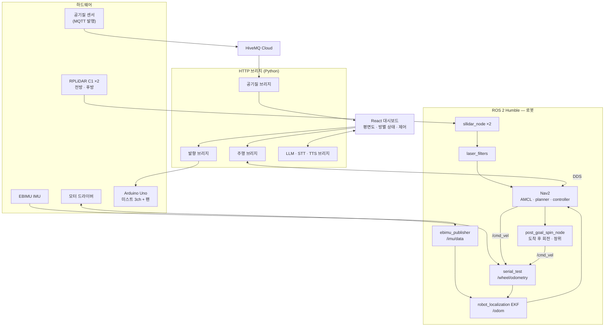
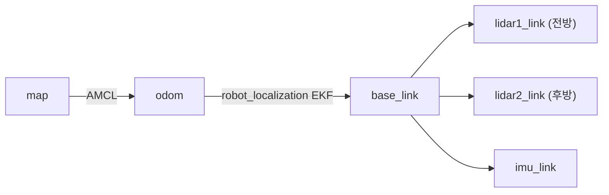
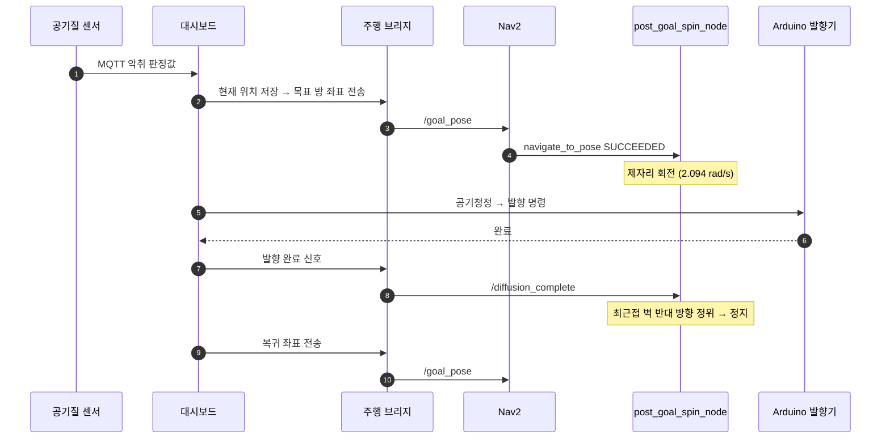

# THIRDIMPACT — 실내 공기질 대응 자율주행 향기 로봇

2026 임베디드 소프트웨어 경진대회 자유공모 출품작 (팀명: **THIRDIMPACT**)

## 개발 인원

**인천대학교 임베디드시스템공학과**

| 역할 | 이름 |
|---|---|
| 팀장 | 이원종 |
| 팀원 | 유태영 |
| 팀원 | 윤우빈 |
| 팀원 | 장예진 |

## 시연 영상

[](https://www.youtube.com/watch?v=EPrZ74PqJmY)

---

실내 공기질을 방 단위로 감시하다가 악취가 감지되면 로봇이 스스로 해당 방으로 이동해
공기청정 → 발향을 수행하고 원위치로 복귀합니다. ROS 2 Humble 자율주행 스택, React 터치
대시보드, Arduino 발향 컨트롤러로 구성됩니다.

---

## 1. 저장소 구조

```
2026ESWContest_free_THIRDIMPACT/
├── slam_ros/                        # ROS 2 워크스페이스 (로봇 · Jetson)
│   └── src/
│       ├── all_in_one_package/      # [자체]  통합 런치 + 자체 개발 노드
│       ├── serial_test/             # [수정]  모터 시리얼 · 휠 오도메트리
│       ├── ebimu_pkg/               # [수정]  IMU 퍼블리셔 + EKF
│       ├── sllidar_ros2/            # [수정]  RPLiDAR C1 ×2 드라이버
│       ├── laser_filters/           # [활용]  LaserScan 각도 필터
│       ├── amr_navigator/           # [수정]  Nav2 브링업 · 파라미터 · 맵
│       ├── amr_cartographer/        # [수정]  Cartographer SLAM (맵 생성용)
│       ├── amr/                     # [수정]  URDF · 메시
│       ├── amr_msgs/                # [활용]  커스텀 메시지 정의
│       └── ros2_laser_scan_merger/  # [미사용] 2-LiDAR 병합 (최종 구성 제외)
│
└── air-scent-dashboard/             # 대시보드 (터치 패널 PC)
    ├── src/                         # [자체]  React 19 + Vite UI
    ├── server/                      # [자체]  Python HTTP 브리지
    ├── firmware/                    # [자체]  Arduino 발향 컨트롤러
    ├── mqtt/                        # [자체]  MQTT 공기질 수신
    └── scripts/                     # [자체]  키오스크 · DDS · 네트워크 설정
```

| 표기 | 의미 |
|---|---|
| **[자체]** | THIRDIMPACT가 새로 작성 |
| **[수정]** | 오픈소스를 기반으로 THIRDIMPACT가 코드·설정을 변경 |
| **[활용]** | 오픈소스를 원본 그대로 사용 |
| **[미사용]** | 저장소에는 있으나 최종 구성에서 실행되지 않음 |

---

## 2. 전체 코드 흐름도

### 2.1 시스템 구성



### 2.2 기동 순서 — `all_in_one_launch.py`

센서 초기화와 Nav2 라이프사이클 경합을 피하기 위해 `TimerAction`으로 단계를 벌려
놓았습니다.

| t (s) | 기동 대상 |
|---|---|
| 0 | 모터 시리얼 · joy · `robot_state_publisher`(URDF) |
| 1 | `ebimu_publisher` + `robot_localization` EKF |
| 4 | LiDAR ×2 + `laser_filters` 필터 체인 ×2 |
| 7 | Nav2 localization (map_server + AMCL) |
| 9 | Nav2 navigation (planner · controller · bt_navigator) |
| 12 | `post_goal_spin_node`, `nav_debug_logger` |

### 2.3 TF 소유권



`odom → base_link` TF는 EKF 하나만 발행합니다. 휠 오도메트리 노드는
`publish_odom_tf = False`, Cartographer는 `provide_odom_frame = false`로 두어 TF
소유권 충돌을 막았습니다.

### 2.4 자율 향기 미션 흐름



새 주행 목표가 접수되면 `post_goal_spin_node`는 어느 상태에 있든 즉시 정지하고
`/cmd_vel` 제어권을 `controller_server`에 돌려줍니다.

---

## 3. THIRDIMPACT가 직접 개발한 것

| 구성요소 | 내용 |
|---|---|
| `all_in_one_package` | 패키지 전체. 단계적 통합 런치 + 아래 두 노드 |
| `post_goal_spin_node.py` | 목표 도착 후 제자리 회전으로 향을 확산시키고, 발향 완료 신호를 받으면 전역 코스트맵에서 최근접 벽을 찾아 **반대 방향으로 정위**한 뒤 정지하는 4-상태 FSM (IDLE / SPINNING / ORIENTING / HOLDING). `velocity_smoother`의 각속도 상한을 우회하기 위해 `/cmd_vel`에 직접 발행하고, 자체 가속 램프(4.0 rad/s²)로 급발진을 막습니다 |
| `nav_debug_logger.py` | 로봇 포즈 · 목표 · `velocity_smoother` 전후 `cmd_vel` · 액션 상태를 CSV로 기록. goal_checker 허용오차 진입 순간을 표시해 "목표에 도달하고도 정지하지 못하는" 현상의 원인을 규명한 계측 노드 |
| `air-scent-dashboard/src/**` | React UI 전체 (페이지 · 훅 · 서비스 · 유틸). Vite 템플릿에서 시작해 전량 작성 |
| `air-scent-dashboard/server/**` | Python HTTP 브리지. 주행 · 공기질 · 발향 · LLM · STT · TTS. 표준 라이브러리 `http.server` 기반 |
| `air-scent-dashboard/firmware/**` | Arduino Uno 발향 컨트롤러 (PlatformIO). 미스트 3채널 + 확산 팬 제어 |
| `air-scent-dashboard/mqtt/**` | HiveMQ 공기질 판정값 수신 |
| `air-scent-dashboard/scripts/**` | 키오스크 실행, CycloneDDS 설정, 로봇 LAN 고정, ROS 2 설치 스크립트 |

---

## 4. 오픈소스를 그대로 사용한 것

| 패키지 / 라이브러리 | `package.xml` 메인테이너 · 출처 | 라이선스 |
|---|---|---|
| `laser_filters` | Jon Binney — ROS 공식 (ros-perception) | BSD |
| `amr_msgs` | `amr@todo.todo` — 외부 AMR 프로젝트 | Apache-2.0 |
| Navigation2 | ROS 2 공식 | Apache-2.0 |
| `robot_localization` | ROS 2 공식 | BSD |
| Cartographer ROS | Google / ROS 2 | Apache-2.0 |
| React 19 · Vite · lucide-react | npm | MIT |
| paho-mqtt · faster-whisper · edge-tts · OpenCV | PyPI | 각 프로젝트 표기 |

외부 API·서비스: NVIDIA NIM(향 추천 LLM), HiveMQ Cloud(MQTT 브로커).

---

## 5. 오픈소스를 가져와 수정한 것

`package.xml`의 메인테이너가 외부인 패키지는 외부 코드로 보고, 그 위에 THIRDIMPACT가
바꾼 부분만 파일 경로로 적었습니다.

| 패키지 | 메인테이너 · 출처 | THIRDIMPACT 수정 내역 |
|---|---|---|
| `sllidar_ros2` | Slamtec `ros@slamtec.com` — 제조사 공식 드라이버 | `launch/sllidar_c1_2_launch.py` **신규 작성** — C1 2대 동시 기동, 고정 심볼릭 포트(`ttyUSB_LIDAR1_FRONT` / `2_REAR`), DenseBoost 모드, 네임스페이스별 필터 체인 연결 |
| `ebimu_pkg` | E2BOX `e2b@e2box.co.kr` — 센서 제조사 제공 | `ebimu_publisher.py` — `sensor_msgs/Imu` 발행, 필드 인덱스·단위·공분산 파라미터화. `config/ekf.yaml` **신규 작성**. `launch/ebimu_ekf.launch.py` **신규 작성** |
| `serial_test` | `amr@todo.todo` — 외부 AMR 프로젝트 | `test_node_main.py` — `/wheel/odometry` 발행, `robot_localization`용 공분산 행렬 지정, `publish_odom_tf = False`로 TF 소유권 분리 |
| `amr_navigator` | `amr2@todo.todo` — 외부 AMR 프로젝트 | `params/nav2_params.yaml` 튜닝(5.2), `map/ff_ekf_3f.*` 실측 맵 생성, `launch/nav2_bringup/` 경로 구성 |
| `amr_cartographer` | `amr@todo.todo` — 외부 AMR 프로젝트 | `config/amr.lua` 파라미터 재작성(5.3) |
| `amr` | JinhoPark `ppp109403@kaist.ac.kr` — [turtlebot3_multi_robot](https://github.com/arshadlab/turtlebot3_multi_robot) 파생 | 사용 범위는 `description/amr_description.urdf`와 메시 한정. 실측에 맞춰 링크·조인트 재정의 (LiDAR 전후방 ±0.355 m, `imu_link` roll=π 역장착 + 마운트 두께 반영) |

### 5.1 EKF 센서 융합 구성 — `ebimu_pkg/config/ekf.yaml`

어떤 상태를 어느 센서에서 받을지 명시적으로 갈랐습니다.

| 입력 | 토픽 | EKF 반영 상태 | 이유 |
|---|---|---|---|
| 휠 오도메트리 | `/wheel/odometry` | `vx`, `vy` | 엔코더 속도는 신뢰. 적분 위치·yaw는 미끄러짐 누적으로 배제 |
| IMU | `/imu/data` | `vyaw` | yaw 절대값 대신 각속도만 사용 (`imu0_relative: true`) |
| — | — | 선형 가속도 제외 | 발행은 하되 EKF 입력에서 제외 (드리프트 원인) |

`two_d_mode: true`, `frequency: 50 Hz`, `world_frame: odom`.

### 5.2 Nav2 파라미터 튜닝 — `amr_navigator/params/nav2_params.yaml`

| 항목 | 값 | 변경 이유 |
|---|---|---|
| `footprint` | `[[0.31,0.24],[0.31,-0.24],[-0.31,-0.24],[-0.31,0.24]]` | 원형 근사 대신 실측 직사각형. 전후로 긴 차체를 좁은 복도에서 정확히 표현 |
| `controller_frequency` | 20 Hz | `post_goal_spin_node`의 `/cmd_vel` 발행 주기와 일치시켜 제어권 전환 시 끊김 방지 |
| `max_vel_x` / `max_vel_theta` | 0.6 / 0.35 | 실내 안전 속도 |
| `goal_checker.xy_goal_tolerance` | 0.16 m | 발향 위치 정확도 요구 |
| `local_costmap.inflation_radius` | 0.40 m (기본 0.55) | 문틀 통과 시 경로가 막히는 문제 해소 |
| `global_costmap.inflation_radius` | 0.50 m | 벽 근접 회피와 통과 가능성의 절충 |
| observation source | `/rplidar1/scan_filtered`, `/rplidar2/scan_filtered` | 병합 노드 없이 두 스캔을 독립 소스로 등록 |

### 5.3 Cartographer 설정 재작성 — `amr_cartographer/config/amr.lua`

| 항목 | 값 | 의도 |
|---|---|---|
| `published_frame` / `provide_odom_frame` | `"odom"` / `false` | EKF가 `odom→base_link`를 소유하므로 Cartographer는 `map→odom`만 담당 |
| `use_odometry` | `true` | EKF 융합 결과 `/odom`을 SLAM 입력으로 사용 |
| `use_imu_data` | `false` | IMU는 EKF 단계에서만 사용 — 이중 반영 방지 |
| `ceres_scan_matcher.rotation_weight` | 250 (기본 20) | 특징이 부족한 복도에서 스캔마다 yaw가 흔들리는 문제 억제 |
| `max_range` | 6.0 m | 실내 규모에 맞춘 제한 |
| `POSE_GRAPH.optimize_every_n_nodes` | 35 | 루프 클로저 빈도 조정 |

---

## 6. 최종 구성에서 사용하지 않는 코드

저장소에 있으나 실행되지 않는 코드입니다. 이전 AMR 프로젝트에서 유래한 잔여 코드이거나
검토 후 채택하지 않은 대안이므로, 본 과제 범위로 오인하지 않도록 명시합니다.

| 경로 | 내용 | 사유 |
|---|---|---|
| `amr_navigator/amr_navigator/elevator_delivery_manager*.py` | 엘리베이터 승하차 배송 관리자 | **본 과제와 무관.** 층간 배송 시나리오용. 어떤 런치에서도 기동하지 않음 |
| `amr_navigator/amr_navigator/floor_map_switcher.py` | 층 전환 시 맵 교체 | **본 과제와 무관.** 단일 층 운용 |
| `amr_navigator/amr_navigator/x_*.py` | 웨이포인트 추종 · 관제센터 연동 | 미사용. 본 과제는 대시보드가 `/goal_pose`로 단일 목표를 직접 지정 |
| `amr_navigator/params/1F~5F_*.yaml`, `config/waypoints*.yaml` | 타 건물 층별 파라미터 · 웨이포인트 | 이전 프로젝트 자산 |
| `ebimu_pkg/ebimu_pkg/elevator_floor_node.py` | IMU 기반 층수 추정 | 런치에서 기동되나 출력 토픽 `/current_floor`를 구독하는 노드가 최종 구성에 없음 |
| `ros2_laser_scan_merger` 전체 | 2-LiDAR 스캔 병합 | 검토 후 미채택. Nav2 costmap이 두 스캔을 직접 받는 편이 좌표 변환 오차가 적었음 |
| `amr/scripts/MotionPlanning/**` | Hybrid A* · MPC · LQR · Stanley 예제 | [zhm-real/MotionPlanning](https://github.com/zhm-real/MotionPlanning) (MIT) 예제. 호출하지 않음. 경로계획은 Nav2 NavFn + DWB 사용 |
| `amr/scripts/ros2_control_center*.py`, `caster_nmpc.py` | 관제 GUI · NMPC 실험 | 이전 프로젝트 잔여 코드 |
| `serial_test/serial_test/test_node_main_*.py` 외 변형본 | 모터 제어 실험본 | `setup.py` 진입점은 `test_node_main.py` 하나만 등록 |

---

## 7. 빌드 및 실행

### 로봇 (Jetson · Ubuntu 22.04 + ROS 2 Humble)

```bash
sudo apt install ros-humble-navigation2 ros-humble-nav2-bringup \
                 ros-humble-robot-localization ros-humble-cartographer-ros \
                 ros-humble-laser-filters ros-humble-joy
pip3 install pyserial scikit-learn transforms3d

cd slam_ros
colcon build --symlink-install
source install/setup.bash

ros2 launch all_in_one_package all_in_one_launch.py
```

USB 장치는 udev 고정 심볼릭 링크를 전제로 합니다:
`/dev/ttyUSB_LIDAR1_FRONT`, `/dev/ttyUSB_LIDAR2_REAR`, `/dev/ttyUSB_IMU`.

맵 생성:

```bash
ros2 launch amr_cartographer amr_cartographer.launch.py
ros2 run nav2_map_server map_saver_cli -f <map_name>
```

### 대시보드 (터치 패널 PC)

```bash
cd air-scent-dashboard
npm install
cp .env.example .env      # NVIDIA_API_KEY 등 입력

npm run dev:all           # 브리지 + Vite 동시 기동
bash scripts/ros/run_ros_nav_bridge.sh
npm run kiosk             # Chromium 키오스크
```

로봇과 대시보드는 CycloneDDS로 같은 `ROS_DOMAIN_ID=3` LAN을 공유합니다.

### 펌웨어

```bash
cd air-scent-dashboard/firmware/fragrace-controller
pio run -e uno_opt -t upload
```
